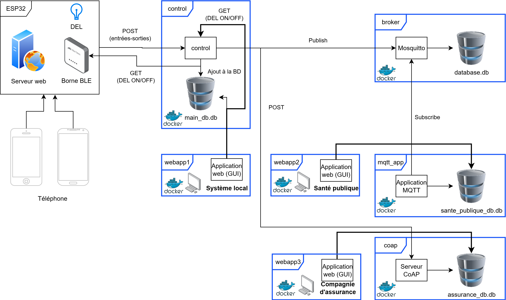

# S6-APP6 - Objects connectés

# Architecture

## Systèmes



## Bases de donneés


# Lancement

## Prérequis
Avoir Docker d'installer sur la machine.

## Lancer le système

Aller à la racine du projet et lancer la commande suivante dans un terminal:

```
docker compose --build up -d
```

# Définition des ports


| Port      | Description    |
| -----------|----------------|
| 80         | Serveur web de l'ESP32                                    |
| 5000       | Server web Flask dans l'app Control (API)                 |
| 5001       | Application web 1 (local)                                 |
| 5002       | Application web 2 (santé publique)                        |
| 5003       | Application web 3 (assurance)                             |
| 5004       | Port de l'applicaton MQTT                                 |
| 5683       | Port UDP pour le serveur CoAP                             |
| 1883       | Port MQTT pour le broker Mosquitto                        |
| 9001       | Port websocket pour le broker Mosquitto (non utilisé ici) |


# ESP32

L'ESP32 permet de détecter les entrées/sorties des appareils et d'envoyer l'information au système de contrôle: le `control`.

Voici les **paramètres à changer** dans le code:
- `main.py`
    - `SSID` :      Nom du réseau Wi-Fi
    - `PASSWORD`:   Mot de passe du réseau Wi-Fi

- `HttpService.cpp`:
    - `LED_GPIO`: Numéro de pin du ESP32 à activer pour allumer la DEL.
    - `SERVER_IP`: IP et port du serveur web vers qui l'ESP envoi les paquets (ex: `"192.168.0.58:5000"`)

# Applications

Les applications sont toutes démarrées dans des conteneur séparés via `docker compose`. Les application sont les suivantes.

## Sercives du `docker compose`

| Application     | Rôle          |
| ----------------| --------------|
| control         | Serveur Flask et application de contrôle et de relai principale. Écrit aussi les entrées et sorties dans la base de données locale. |
| broker          | Broker Mosquitto qui permet de recevoir l'information des publisher et de la renvoyer aux subscibers. |
| mqtt_app        | Permet de recevoir l'information des topics auxquels elle est inscrit et d'écrire l'information dans sa base de données (santé publique). |
| coap_server     | Permet de recevoir les POST du protocole CoAP fait depuis le `control` et écrire l'information des entrée-sortie dans sa base de données. |
| webapp1         | Application web de visualisation des données d'entrée-sortie (local). Permet aussi d'allumer et éteindrre la DEL du ESP32.|
| webapp2         | Application web de visualisation des données d'entrée-sortie (santé publique). |
| webapp3         | Application web de visualisation des données d'entrée-sortie (assurance). |

## Réseau

Toutes les applications fonctionnent sur le même réseau dans le cadre de la preuve de concept, même si l'architecture sépare en 3 instances le système local, la santé publique et la compagnie d'assurance.

Le réseau `app-network` est défini dans le fichier `docker-compose.yml`.

## Control (API)

Le `control` permet de
- Revecoir les paquets de l'ESP32 (POST), qui lui envoie les appareils qui ont entrés ou sortie de la pièce.
- Recevoir l'ordre (GET) d'allumer ou éteindre une DEL sur l'ESP32.
- Écrire les entrées et sorties dans la base de données locale.
- Publier vers le `broker` via le protocole MQTT l'information d'entrée-sortie sur le topic `/device/entries`.
- Faire un post via la protocole CoAP (vers le `coap_server`) pour envoyer les informations d'entrée-sortie.

Voici les **paramètres à changer** dans le code:
- `docker-compose.yml`:
  - `control`:
    - `environment`:
      - `DEVICE_IP`:    IP de l'ESP32


### Base de données

La base de données sqlite `main_db.db` est liée à ce conteneur par un volume. C'est dans cette base de données de `control` écrira les informations reçues.

#### Table

| entries       |
| ------------- |
| device_id     |
| time          |
| access_type   |


## Server Mosquitto (`broker`)

L'image eclipse-mosquitto est utilisée pour créer le conteneur.

## Application MQTT (`mqtt_app`)

L'application MQTT permet de s'abonner à des topics du coté de la santé publique et d'écrire l'information dans sa base de données quand elle reçoit des mise à jour.

### Topic 

Les topics auxquels l'application est abonnée sont les suivants (il n'y en a qu'un dans le cadre de la preuve de concept):
- `device/entries`

### Base de données

La base de données sqlite `sante_publique_db.db` est liée à ce conteneur par un volume. C'est dans cette base de données de `mqtt_app` écrira les informations reçues.

#### Tables

| entries       |
| ------------- |
| device_id     |
| time          |
| access_type   |

| persons       |
| ------------- |
| device_id     |
| first_name    |
| last_name     |
| email         |

| vaccination_status  |
| ------------------- |
| email               |
| first_name          |
| last_name           |
| vaccination_status  |

#### Vue

| device_vaccination_status  |
| -------------------------- |
| device_id                  |
| time                       |
| access_type                |
| first_name                 |
| last_name                  |
| vaccination_status         |


## Serveur CoAP (`coap_server`)

Le serveur CoAP permet de recevoir des requêtes POST depuis le `control` et d'écrire l'information reçue dans sa base de données.

### Base de données

La base de données sqlite `assurance_db.db` est liée à ce conteneur par un volume. C'est dans cette base de données de `coap_server` écrira les informations reçues.

#### Tables

| entries       |
| ------------- |
| device_id     |
| time          |
| access_type   |

| persons       |
| ------------- |
| device_id     |
| first_name    |
| last_name     |
| email         |

| client_info   |
| ------------- |
| email         |
| first_name    |
| last_name     |
| phone         |

#### Vue

| device_client_info  |
| ------------------- |
| device_id           |
| time                |
| access_typ          |
| first_name          |
| last_name           |
| phone               |


## Applications web

### `webapp1`

La première application web est une application Streamlit qui fait office d'interface utilisateur pour 2 fonctions:
- Allumer une DEL sur l'ESP32 à l'aide d'une `checkbox`.
- Afficher les données d'entrée-sortie des appareils dans une table.

### `webapp2`

La seconde application web est une application Streamlit qui fait office d'interface utilisateur afficher la vue de la base de données de santé publique qui permet de démontrer l'association entre un appareil et le statut vaccinal d'une personne.

### `webapp3`

La troisième application web est une application Streamlit qui fait office d'interface utilisateur afficher la vue de la base de données de la compagnie d'assurance qui permet de démontrer l'association entre un appareil et les informations personnelles d'une personne (ex: numéro de téléphone).

